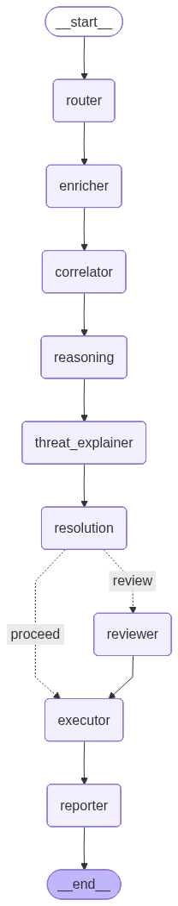

# AI Security Threat Intelligence System

An agentic AI security project built with **LangGraph**, **FastAPI**, and **Streamlit**.

It investigates threat indicators (IP, domain, URL, file hash), enriches them with external threat intel APIs, generates AI-powered analysis using a **local Ollama model** (`gpt-oss:latest`), and shows actionable remediation steps.

## What This Project Does

- Accepts a user threat query (single or multiple indicators).
- Extracts indicators from the query.
- Enriches indicators using:
  - VirusTotal
  - AbuseIPDB
  - Shodan
- Correlates results and computes risk/confidence.
- Uses LangGraph nodes to generate:
  - Threat explanation text
  - Resolution/remediation steps
  - Recommendations
- Stores investigations locally and lets you:
  - View chat-specific stats
  - Re-open previous chats
  - Delete chats
  - Export reports as Markdown and PDF

## LangGraph Flow

The workflow graph below is generated from the LangGraph Mermaid diagram.



Main flow (node-by-node):

- `router`: Extracts and classifies indicators (IP, domain, URL, hash) from the user query.
- `enricher`: Calls VirusTotal, AbuseIPDB, and Shodan to gather threat intelligence for each indicator.
- `correlator`: Combines multi-source signals into a normalized risk score and summary findings.
- `reasoning`: Uses the local Ollama model to generate analyst-style interpretation and recommendations.
- `threat_explainer`: Produces a clear, human-readable explanation of why each indicator is risky or benign.
- `resolution`: Generates practical remediation steps based on severity and indicator type.
- `reviewer/executor`: Applies review logic for higher-risk cases and runs simulated response actions.
- `reporter`: Builds the final investigation report used by the UI and export features.

## Prerequisites

- Python 3.11
- Ollama installed and running locally
- Ollama model available: `gpt-oss:latest`
- API keys for:
  - VirusTotal
  - AbuseIPDB
  - Shodan

## Setup

1. Create and activate virtual environment:

```bash
python -m venv venv
venv\Scripts\activate
```

2. Install dependencies:

```bash
pip install -r requirements.txt
```

3. Configure environment:

```bash
copy .env.example .env
```

Edit `.env` with your values:

```env
OLLAMA_BASE_URL=http://localhost:11434
OLLAMA_MODEL=gpt-oss:latest

VIRUSTOTAL_API_KEY=...
ABUSEIPDB_API_KEY=...
SHODAN_API_KEY=...
```

4. Ensure Ollama is ready:

```bash
ollama serve
ollama pull gpt-oss:latest
```

## Run the Project

### 1) Start backend

```bash
python -m uvicorn backend.main:app --host 0.0.0.0 --port 8000
```

### 2) Start frontend

```bash
streamlit run frontend/app.py
```

### Optional: Regenerate LangGraph PNG

```bash
python -c "import sys; sys.path.insert(0,'.'); from threat_intel_agent.src.graph import compile_graph; g=compile_graph(); open('docs/langgraph_flow.png','wb').write(g.get_graph().draw_mermaid_png())"
```

## API Endpoints

- `POST /investigate` - start investigation
- `GET /investigation/{id}` - get full investigation
- `GET /investigation/{id}/stats` - get chat-specific stats
- `DELETE /investigation/{id}` - delete investigation
- `GET /investigations` - list recent investigations
- `GET /stats` - global statistics

## Example Queries

- `1.1.1.1`
- `8.8.8.8`
- `evil.com`
- `https://malware.test/payload`
- `d41d8cd98f00b204e9800998ecf8427e`
